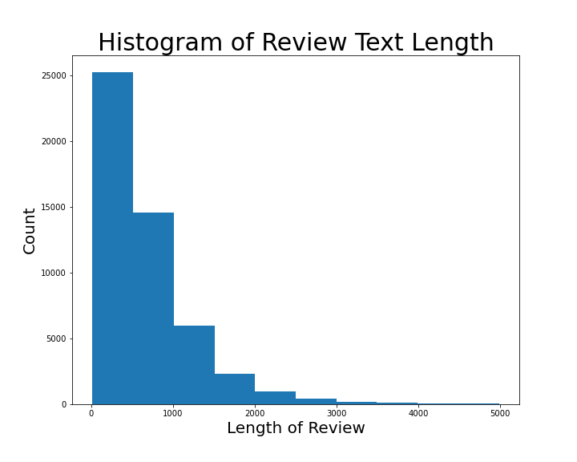
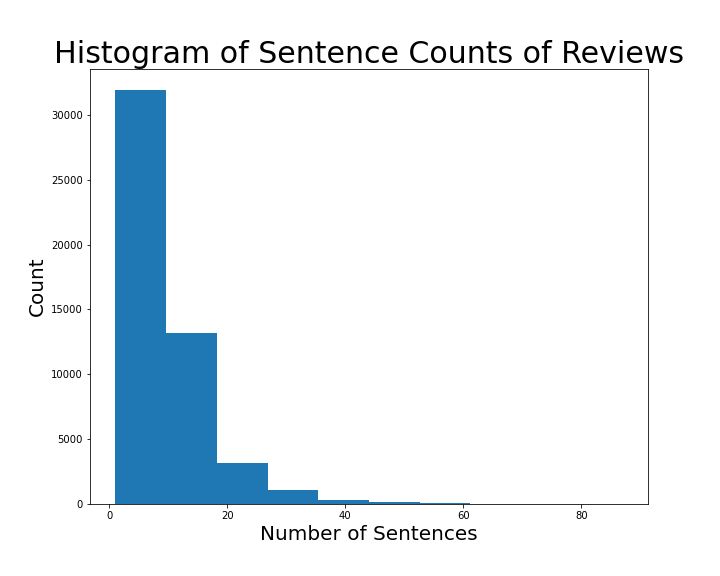

# Yelp-Review-Categorizer

## Problem Statement

Yelp has revolutionized the way that we choose restaurants. With just a click of a button we can search by cuisine, distance, price, and more. The recommender system is based on reviews that are made by users. These reviews cover different aspects of the restaurant: food, service, wait time, etc., but the resulting rating is for all of these aspects combined. I want to be able to filter on these specific attributes. Using NLP I will parse these reviews into their different categories and use Sentiment Analysis to give scores in each of these categories.

## Data and Collection

### Size

San_Francisco_restaurant_reviews.csv (50_000, 4)

 - 50 Restaurants each with their 1000 most recent reviews
    
San_Francisco_restaurant_reviews_first_5.csv (40_930, 4)

 - 5 Restaurants with 40_930 total reviews
    
San_Francisco_restaurant_reviews_sentences.csv (469_122, 4) 

 - 50 Restaurants with their reviews parsed into 469_122 sentences

San_Francisco_restaurant_reviews_first_5_sentences.csv (389_760, 4)

 - 5 Restaurants with their reviews parsed into 390257 sentences

#### Data Dictionary

San_Francisco_restaurant_reviews.csv (50_000, 4)
San_Francisco_restaurant_reviews_first_5.csv (40_930, 4)

|Feature|Type|Description|
|---|---|---|
|restaurant_name|object|Name of restaurant|
|restaurant_rating|float|Yelp rating of restaurant|
|customer_rating|int|Individual review rating|
|review_text|object|Text of review|

San_Francisco_restaurant_reviews_sentences.csv (469_122, 4) 
San_Francisco_restaurant_reviews_first_5_sentences.csv (389_760, 4)

|Feature|Type|Description|
|---|---|---|
|restaurant_name|object|Name of restaurant|
|restaurant_rating|float|Yelp rating of restaurant|
|customer_rating|int|Individual review rating|
|review_text|object|Text of review|
|review_text_length|int|Character count of review|
|sentences|list|List of sentences of review|
|sentence_count|object|Number of sentences in review|
|review_id|int|Id for review|
|sentence|object|Individual sentence|

### Collection Notes

- Collected the first 1000 reviews from 50 restaurants for variety
- Data collection took around 30 minutes
- Collected all the reviews for 5 restaurants

## Data Cleaning and EDA

### Cleaning

- Removed html characters '<\br>' and html links
- Replaced html characters &#39, &#34, &amp, \xa0
- After creating sentences some of the sentences made were white spaces or emojis. Used regex to clean out sentences that didn't have any alphabetical characters or were just white spaces.

### EDA

- The average review length: 677 characters
- The average restaurant rating: 4.25
- Minumum and maximum restaurant rating: 4-5
- The average sentences per review: 9

## Creating sentences

- Used spacey to create sentences from the reviews
- Then transformed the dataframe so each row held a sentence of a review
- From the 50_000 reviews 469_663 sentences were found

- From the 40_930 reviews found for the 5 restaurants 389_760 sentences were found

## Sentence Categorization

- Lemmatized the sentences using nltk's WordNetLemmatizer and counted the occurences of each of the lemmatized words.
- Removed all English stopwords.

2 Charts for the top 60 most frequent words:

- Went through the 635 words with over 1000 frequency and added them to three categories food_words, service_words, and time_words. 
- The list of words are stored in the assets folder
- Went through each sentence and looked if any of the words matched in the lemmatized words

- Categorized sentence breakdown

|Sentence Category|Count|
|---|---|
|Food|261_459|
|Service|39_215|
|Time|61_131|
|Uncategorized|149_072|

- After parsing through the sentences many of the sentences were still in the wrong category. Some of the uncategorized sentences referred to food, but had specific food items that weren't caught by the food key words. Some sentences referred to the food, but didn't have any key words referring to the food so those weren't picked up as well. 

#### Sentiment Analysis

## Notes

- Since the SentimentIntensityAnalyzer gave values from [-1, 1] the scores were added by 1 to get the range to [0,2] and multipled by 5/2 to get to a range [0,5]

## Sentiment Analysis Test

- First performed sentiment analysis on the first five restaurants and all of their reviews to see if the sentiment analysis was giving similar scores as the reviews

|Restaurant|Yelp Rating|Sentiment Analysis Rating|
|---|---|---|
|Brenda's French Soul Food|4.0|4.45|
|Tartine Bakery|4.0|4.26|
|House of Prime Rib|4.0|4.41|
|Hog Island Oyster|4.5|4.56|
|Gary Danko|4.5|4.65|

- After processing all of the reviews through sentiment analysis and averaging them, the scores received were close to the yelp review scores. 

## Sentiment Analysis of Categorized Sentences

First 5 restaurants from the 50

|Restaurant|Yelp Rating|Food Rating|Service Rating|Time Rating|
|---|---|---|---|---|
|Gary Danko|4.5|3.26|3.34|3.10|
|State Bird Provisions|4.0|3.24|3.39|3.08|
|Chapeau|4.5|3.34|3.51|3.17|
|Nopa|4.0|3.34|3.51|3.11|
|Lolinda|4.0|3.32|3.35|3.17|

- The resulting scores for the categories were all lower than the average scores. There are a few factors going into this.
    
1. Not all of the reviews were used for each restaurant. Pulling thousands of more reviews was too intensive in computing power, but we wanted a wide range of reviews from different restaurants to help build the categorizer

2. Of the sentences that weren't categorized many were sentiments of the restaurant as a whole rather. Since the average rating of each of these restaurants was 4.25 these sentiments would've boosted the sentiment score.

## Conclusions

- After building a rough categorizer from key words we were able to grab scores in different categories using sentiment analysis.
- Using keywords to categorize sentences was a good first step, but we would want to make a classification model for a more robust way of categorizing the sentences.
- The data used was for 50 restaurants with 1000 reviews each. These weren't all the reviews and so the results could've highly varied if all the data had been pulled. These restaurants were also all within the rating of 4-5 so testing on restaurants with lower ratings could help see more diverse results.
- Overall this data is highly subjective, so even after assigning values these numbers are still arbitrary. It is hard to say how much higher a food rating of 3.34 is versus a food rating of 3.24

